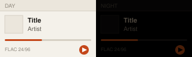
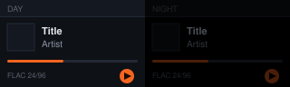
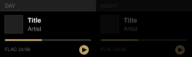

# Gallery

*Rebuilt by CI from `palettes/` on every push to main — do not edit by hand.*

Each preview is drawn from the file with the colours the player draws: day on the left, night (dimmed, as the panel shows it) on the right. A palette without an accent of its own is shown with Amber, and works with all six of Cinder's accents.

| | Palette | File |
|---|---|---|
|  | **Paper** own accent | [`paper.palette`](palettes/paper.palette) |
|  | **Slate** any accent | [`slate.palette`](palettes/slate.palette) |
|  | **Sony** own accent | [`sony.palette`](palettes/sony.palette) |
